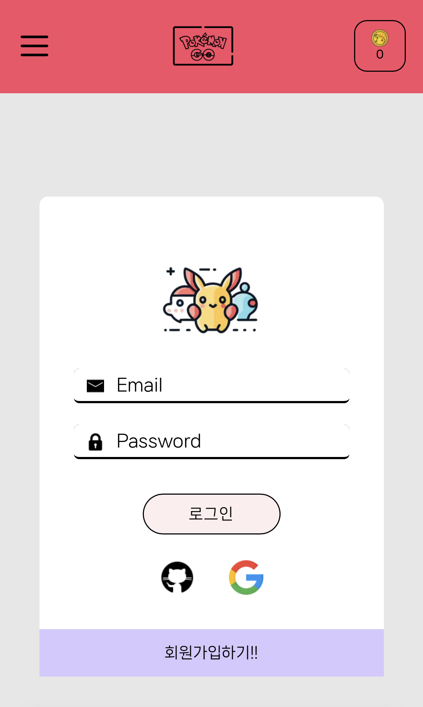

## 프로젝트 소개

- 간단한 미니 게임을 통해 코인을 획득하고, 모은 코인으로 포켓몬 뽑기를 진행하여 다양한 등급의 포켓몬을 수집하는 웹 애플리케이션 입니다.
- 포켓몬 전체 도감 메뉴를 통해 포켓몬 검색, 상세 정보를 확인할 수 있습니다
- 로그인 사용자는 코인 관리 및 나만의 도감을 완성할 수 있습니다.

## 프로젝트 목적

- 상태 관리, react query를 활용한 데이터 페칭 등 React 핵심 개념을 실전에서 활용하고자 했습니다.

##

test id:test@id.test
test pw:test1234

## 개발기간

- 2024.11 ~ 2025.03

## 기술스택

  
  
  
  
  

## 주요기능

- 회원가입 및 로그인 기능을 통해 유저별 코인과 포켓몬 데이터를 분리 저장
- 코인 획득 게임 을 통해 얻은 코인은 해당 사용자의 데이터로 저장
- 포켓몬 뽑기 기능을 통해 뽑은 포켓몬은 사용자의 도감에 저장
- 전체 포켓몬 리스트를 조회하고, 검색·정렬·필터링 할 수 있는 포켓몬 도감 기능
- 내가 뽑은 포켓몬만 볼 수 있는 개인 도감 기능
- 도감 데이터를 불러오는 동안 Skeleton UI로 로딩 상태 표시

## 페이지별 기능

### [회원가입]

- 이메일/비밀번호 기반 회원가입 및 로그인이 가능합니다.
- 소셜 로그인(GitHub, Google)기능을 지원 합니다.

  

### [미니게임]

- 주어진 시간이내에 알을 깨면 랜덤의 포켓몬이 등장합니다.
- 등장한 포켓몬의 종족값에 따라 코인이 주어집니다.

  

### [전체도감]

- 이름/번호 검색, 타입 필터링, 스탯 정렬 등 다양한 조건으로 도감 탐색이 가능합니다.
- 각 포켓몬 카드 클릭시 상세정보 모달이 표시됩니다.

  

## [포켓몬 뽑기]

- 미니게임을 통해 획득한 코인으로 등급별 포켓몬을 뽑을 수 있습니다.
- 선택한 등급에 따라 해당 랭크 포켓몬 중 무작위 1종이 등장합니다.

  

## [내도감]

- 뽑기를 통해 등장한 포켓몬이 내 도감에 저장됩니다.
- 내 도감 내에서도 이름/번호 검색, 타입 필터링, 스탯 정렬 등 다양한 조건으로 탐색이 가능합니다.
- 각 포켓몬 카드 클릭시 상세정보 모달이 표시됩니다.

  
